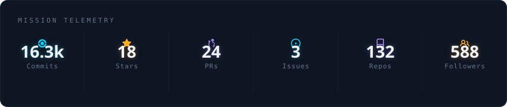

  

 

  

 

  

 

  

 

## Acerca de

**Ingeniero de Plataformas Staff @ WEX Inc** — Más de 14 años construyendo plataformas que escalan.

### Logros destacados
- **API Gateway Active-Active** (Apigee X) con una disponibilidad del **99.999%** para pagos de misión crítica
- **Proveedor personalizado de Terraform** construido desde cero en Go — tiempo de incorporación de desarrolladores reducido en un 60%
- Cumplimiento de **PCI-DSS 4.0** con implementaciones Blue/Green de cero tiempo de inactividad
- **Madurez de gobernanza de APIs** 2.1 → 4.3, adoptada por más de 15 equipos en verticales de Fintech
- Transformaciones de **monolito a microservicios** con una reducción del 40% en costos
- **Especialización en ML de Stanford** · KCNA · LPIC-1 · Ingeniería en Computación (FURG)
- **Más de 5 publicaciones académicas** sobre ciencia abierta e infraestructura de datos de investigación

 

  
  
  
  
  

 

  

---
