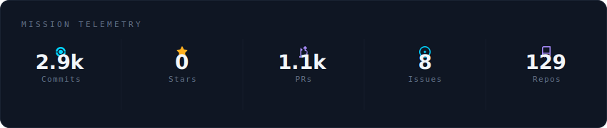

  

 

  

 

  

 

  

 

<strong>More about me</strong>

 

### 🚀 Current Role
**Specialist Platform Engineer @ WEX Inc** — Portland, ME (Remote from Brazil)

Architecting globally distributed API Gateway solutions (Apigee X) with 99.999% availability for mission-critical payment systems. Leading infrastructure modernization for PCI-DSS 4.0 compliance and building custom Terraform providers in Go to accelerate developer onboarding.

### 💡 Expertise

**Platform Engineering & Cloud Infrastructure**
- Kubernetes orchestration across AWS EKS & GCP GKE with Istio service mesh
- Infrastructure as Code: Terraform, ArgoCD, GitOps workflows
- API Gateway: Google Cloud Apigee X, Active-Active global distribution
- Custom tooling: Built Terraform Provider from scratch using Go

**DevSecOps & Observability**  
- CI/CD pipeline optimization for zero-downtime deployments
- "Dashboards as Code" with Grafana, Prometheus, and OpenTelemetry
- Blue/Green deployment strategies for PCI-DSS regulated environments
- Security automation & compliance tooling

**Software Architecture**
- Microservices design patterns for Fintech ecosystems  
- Event-driven architectures with high scalability
- API design, documentation, and developer experience optimization
- Domain-Driven Design & system architecture at enterprise scale

### 🎓 Education & Certifications
- **Machine Learning Specialization** — Stanford University (2021)
- **Bachelor's in Computer Engineering** — Federal University of Rio Grande (FURG)
- **Kubernetes and Cloud Native Associate (KCNA)** — CNCF
- **Certified Linux Administrator (LPIC-1)** — LPI

### 🌐 Languages
Portuguese (Native) • English (Fluent) • Spanish (Intermediate) • Italian (Elementary)

### 📊 Career Highlights
- **12+ years** of software engineering and platform innovation
- Architected **Active-Active API Gateway** serving millions of payment transactions
- Reduced developer onboarding time by **60%** through custom automation tools
- Led **cloud migration** projects optimizing infrastructure costs by 15%+
- Published **5+ academic papers** on open science, data repositories, and research infrastructure

 

  
  
  
  
  

 

  

---

  Profile SVGs auto-generated by <a href="https://github.com/vinimlo/galaxy-profile">galaxy-profile</a>

