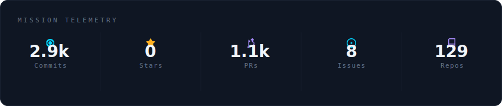

  

 

  

 

  

 

  

 

## About

**Specialist Platform Engineer @ WEX Inc** — 14+ years building platforms that scale.

### Highlights
- **Active-Active API Gateway** (Apigee X) with **99.999%** availability for mission-critical payments
- **Custom Terraform Provider** built from scratch in Go — developer onboarding time cut by 60%
- **PCI-DSS 4.0** compliance with Blue/Green zero-downtime deployments
- **API governance maturity** 2.1 → 4.3, adopted by 15+ teams across Fintech verticals
- **Monolith → microservices** transformations with 40% cost reduction
- **Stanford ML Specialization** · KCNA · LPIC-1 · Computer Engineering (FURG)
- **5+ academic publications** on open science and research data infrastructure

### Ecosystem — [.dev.br](https://mapa.dev.br)
Open-source Platform Engineering education funnel I built and maintain:

| Product | What | Link |
|---------|------|------|
| **Mapa** | 7 free technical roadmaps — Linux to Kubernetes | [mapa.dev.br](https://mapa.dev.br) |
| **Metodo** | Structured program with real projects and mentorship | [metodo.dev.br](https://metodo.dev.br) |
| **Clube** | Community with hands-on projects, immersions, and mentoring | [clube.dev.br](https://clube.dev.br) |
| **Plataforma** | Enterprise consulting executed by a team of engineers | [plataforma.dev.br](https://plataforma.dev.br) |

> Full career details, publications, and work history → [LinkedIn](https://www.linkedin.com/in/adornetejr/)

 

  
  
  
  
  

 

  

---
